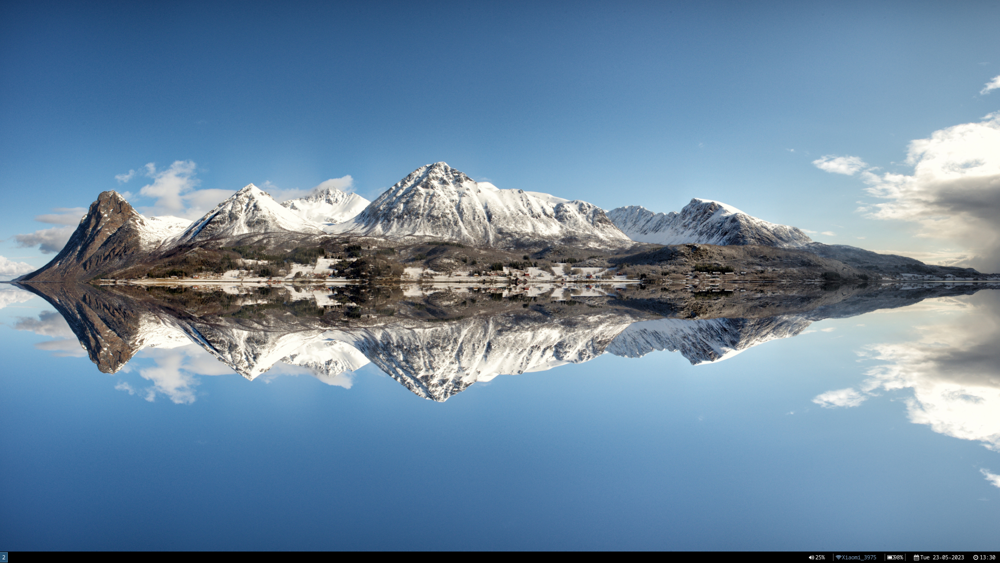
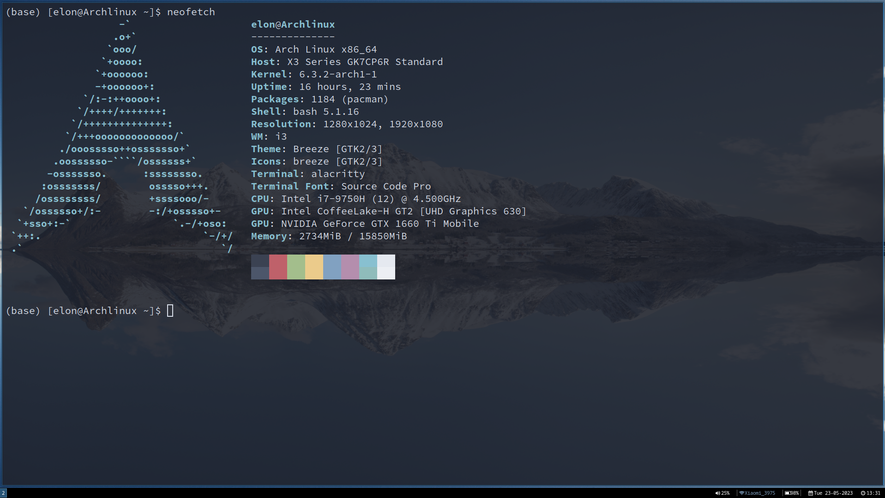
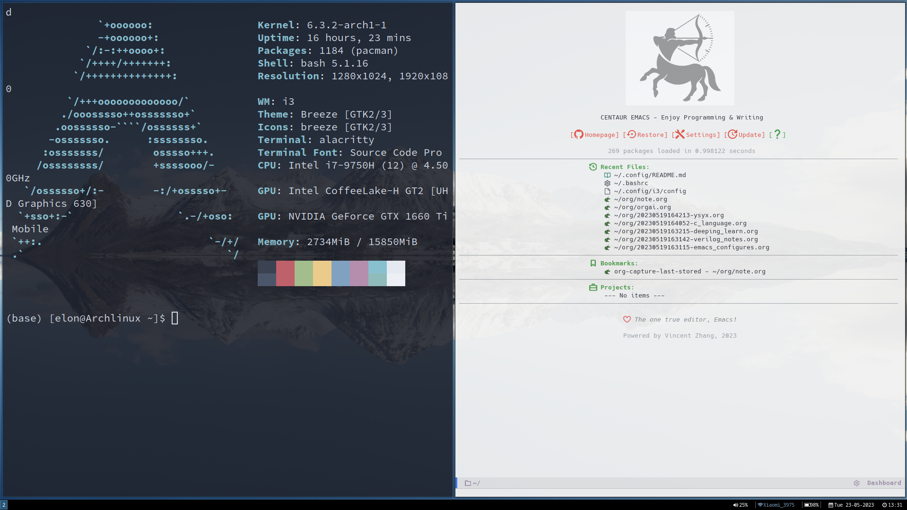

<div align="center">

  # 🌸**A simple easy i3wm dotfiles**🌸


  <br/>

  ## 📺 Video

https://github.com/Elonisme/dotfiles-i3/assets/87638888/8121b98c-5beb-499d-859b-f636800eebac

  ## 🎉 Preview
  
  
  


</div>

## 🔌 Details
  - OS: Arch Linux
  - Compositor: i3wm
  - lock:i3lock-color
  - Terminal: alacritty
  - Wallpaper: archlinux-wallpaper
  - Search menu: rofi
  - Font: Source Code Pro
  - Browser: chromium

  ## 🖌 Usage
  ### 🔧 Required dependencies:
  ```bash
  sudo pacman -S i3-wm i3status i3blocks alacritty picom fcitx5 rofi xfce4-power-manager feh network-manager-applet i3lock-color archlinux-wallpaper
  sudo pacman -S nvidia nvidia-settings lib32-nvidia-utils
  yay -S optimus-manager optimus-manager-qt
  ```

  ### 🛠 Setup i3 Config
 ```bash
 git clone https://github.com/Elonisme/dotfiles-i3.git ~
 cd dotfiles-i3
 mv alacritty/ ~/.config/
 mv i3/ ~/.config/
 mv i3status/  ~/.config/
 mv i3lock/ ~/.config/
 mv rofi/ ~/.config/
 mv open_side.sh ~
 mv wallpic.sh ~/Documents/
 ```

  ### 📰 description
  The open_side.sh is a script to open secondary screen. But everyone’s computer hardware is different. Thus, you could adjust the interface name of the display in the script.
  Please refer to the 'xrandr' command. I recommend you to read [i3wm 用户说明书](https://zjuyk.site/i3wm-userguide-zh/%E4%BB%8B%E7%BB%8D.html). And the wallpic.sh use the package of archlinux-wallpaper. But you could change the wallpaper path.

  In addition, you can change the path of the script as you want, but please you mind to change the path in the configuration file.
